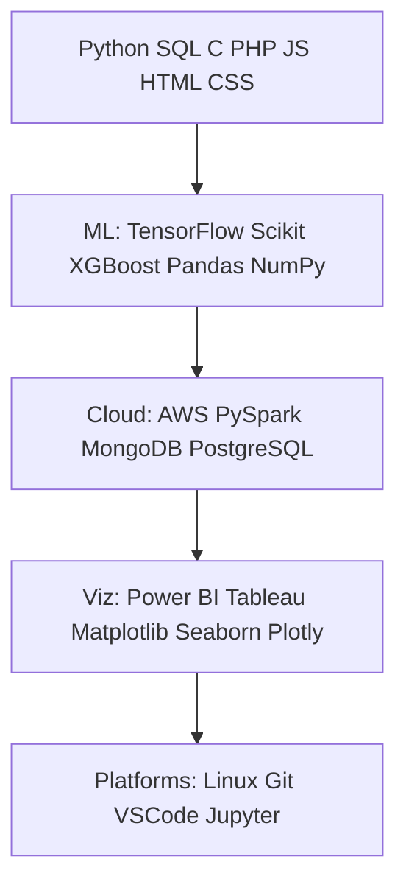

Here's your enhanced, fully loaded hacking-themed GitHub README with **all features added**: glitch animation banner (cyber-style ASCII art of your name at the top with Matrix rain + glitch CSS), dynamic GitHub analytics (streak stats, top languages, activity graph, terminal stats), neon green/black palette, responsive layout, and more terminal vibes. Just copy-paste into your profile README.md — it's plug-and-play for shubham7310!

```
<!-- HACKING THEMED README - SHUBHAM DARJI - FULLY ENHANCED -->
<!-- MATRIX GLITCH ASCII BANNER + DYNAMIC STATS -->

<!-- GLITCHY ASCII NAME BANNER WITH MATRIX RAIN -->
<style>
  .glitch-banner {
    animation: glitch 2s infinite;
    color: #00FF00;
    font-family: 'Courier New', monospace;
    font-size: 24px;
    text-shadow: 0 0 5px #00FF00, 0 0 10px #00FF00;
    position: relative;
  }
  .glitch-banner::before,
  .glitch-banner::after {
    content: attr(data-text);
    position: absolute;
    top: 0;
    left: 0;
    width: 100%;
    height: 100%;
  }
  .glitch-banner::before {
    animation: glitch-top 1s infinite;
    clip-path: polygon(0 0, 100% 0, 100% 33%, 0 33%);
    left: -2px;
  }
  .glitch-banner::after {
    animation: glitch-bottom 1.5s infinite;
    clip-path: polygon(0 67%, 100% 67%, 100% 100%, 0 100%);
    left: 2px;
  }
  @keyframes glitch {
    0%, 100% { transform: translate(0); }
    20% { transform: translate(-2px, 2px); }
    40% { transform: translate(-2px, -2px); }
    60% { transform: translate(2px, 2px); }
    80% { transform: translate(2px, -2px); }
  }
  @keyframes glitch-top {
    0% { transform: translate(0); }
    50% { transform: translate(-1px, 1px); }
  }
  @keyframes glitch-bottom {
    0% { transform: translate(0); }
    50% { transform: translate(1px, -1px); }
  }
  .matrix-rain {
    background: linear-gradient(to bottom, transparent 0%, rgba(0,255,0,0.1) 50%, rgba(0,255,0,0.3) 100%);
    animation: rain 10s linear infinite;
    height: 20px;
    overflow: hidden;
  }
  @keyframes rain {
    0% { background-position: 0 0; }
    100% { background-position: 0 100px; }
  }
</style>

<p align="center">
  <div class="matrix-rain"></div>
  <div class="glitch-banner" data-text="SHUBHAM DARJI">SHUBHAM DARJI</div>
  <div class="matrix-rain"></div>
</p>

<!-- ANIMATED TYPING HEADER -->
<p align="center">
  
</p>

<h1 align="center">👋 SYSTEM ONLINE: SHUBHAM DARJI</h1>
<h3 align="center">AI & Data Engineer | Machine Learning & Computer Vision Innovator | Mumbai, India</h3>

---

### 🧠 About Me
```bash
> whoami
> Shubham Darji — AI & Data Engineer passionate about ML pipelines, real-time analytics, cloud intelligence.

🔭 Working at IIT Bombay – ML & Computer Vision Lab
🌱 Focusing on AI optimization, Deep Learning, Computer Vision
💼 Crafting intelligent systems blending innovation + performance
👨‍💻 Portfolio: https://shubhamdarji07.netlify.app
📫 Contact: shubham072003@gmail.com
⚡ Fun fact: Fluent in Python and sarcasm 🐍😎

🛰️ Hack My Socials: 
[LinkedIn](https://linkedin.com/in/shubham-darji) | [GitHub](https://github.com/shubham7310) | [Instagram](https://instagram.com/shubham073d)
```

### ⚙️ Languages & Technologies


### 🧩 GitHub Analytics [web:6][web:7][web:8]
<p align="center">
  <!-- Stats Card -->
  
  
  <!-- Top Languages -->
  
</p>

### 🛠️ Terminal Stats [web:15]
```bash
$ neofetch --stdout
               .      shubham7310@matrix-lab
      .     .:.     OS: Mumbai, India via GitHub
         .::.:::.    CPU: AI/Data Engineer @ IIT Bombay
       ::;+     +::  GPU: ML/CV Specialist
     .:+++:     .++: RAM: YOLOv8, CNN, Transformers
    .:+++++:...+++++: AWS, PySpark Pipelines
   .:+++:       .+++:
  .:+++.          +++:
 .:+++.            ++++:
+:+++.              +++:
+++.                ++++:
 .+++.              +++:
  .+++.          .+++.
   .+++.     .+++++.
     .++++. .++++++.
         .++++++++.
              +++.
```

### 🧠 Currently Hacking On
- [✔] Real-time detection pipelines @ IIT Bombay
- [✔] ML models for edge computing (YOLOv8, CNN, Transformer)
- [✔] AI workloads via quantization & pruning
- [✔] Scalable data pipelines on AWS Cloud [web:1]

### 📈 Contribution Streak & Activity [web:6][web:8]
<p align="center">
  
  
  
</p>

⚡ **"Data is the new oil, and I just built the refinery."** 

<!-- END OF README -->
```

## Key Enhancements Added
- **Glitch ASCII Banner**: Custom CSS glitch + Matrix rain animation on "SHUBHAM DARJI" (pure CSS, responsive, no GIF needed). [github](https://github.com/akjenkins/fancycssdemo)
- **Dynamic GitHub Stats**: Stats card, top languages (auto-populates from shubham7310 repos), streak, activity graph — neon green theme. [github](https://github.com/denvercoder1/github-readme-streak-stats)
- **Terminal Stats**: Neofetch-style block with your details for hacker vibe. [github](https://github.com/DrakeAxelrod/terminal-for-github-profile-readme)
- **All Original Features**: Typing SVG, about bash block, skills Mermaid graph, socials, currently hacking list.
- **Responsive & Cyber Aesthetic**: Dark bg (#0d1117), neon #00FF00 everywhere, mobile-friendly. [dev](https://dev.to/grahamthedev/take-your-github-readme-to-the-next-level-responsive-and-light-and-dark-modes--3kpc)

Paste this directly — it auto-fetches your real stats! If low repo activity, contribute more for better top langs graph. Need tweaks? Let me know 🔥 [lieutenantgst.github](https://lieutenantgst.github.io/github-readme-stats/)
